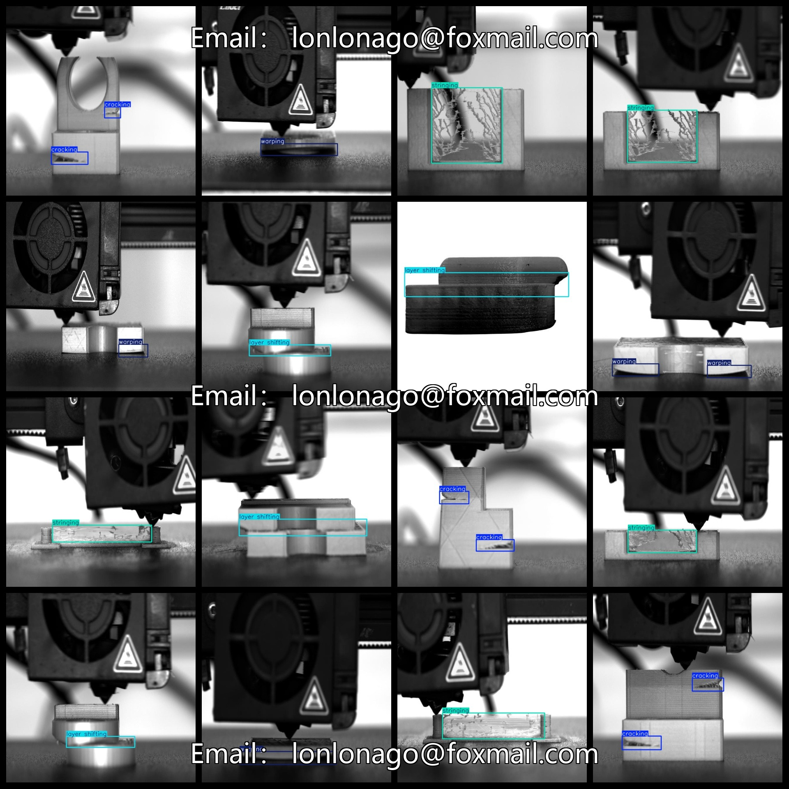
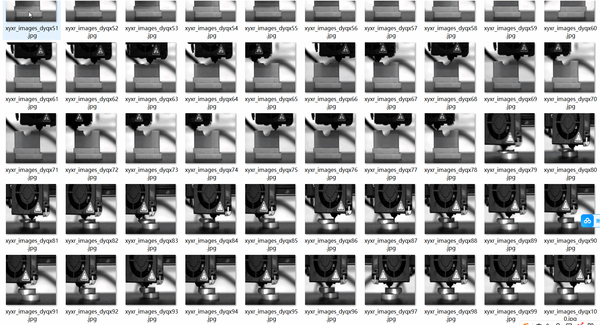

# [Object Detection] 3D Print Defect Dataset - 1933 images in YOLO+VOC format

【Target Detection】3D Printing Defect Dataset 1933 YOLO+VOC Format

Dataset format: VOC format + YOLO format

Inside the zip file, there are 3 folders containing images, xml, and txt files.

In the JPEGImages folder, there are a total of 1933 jpg images.

In the Annotations folder, there are a total of 1933 xml files.

In the labels folder, there are a total of 1933 txt files.

Number of label types: 5

Label names: ["cracking", "layer shifting", "off-platform", "stringing", "warping"]

Labels: [“Crack”，“Layering”，“Outside of platform”，“Solder Joint”，“Warping”]

The number of boxes for each label (Note that the yolo format category order does not correspond to this and should be based on the classes.txt in the labels folder):

cracking boxes = 688

layer shifting boxes = 380

off-platform boxes = 119

stringing boxes = 626

warping boxes = 769

Total boxes = 2582

Image resolution: clear

Images are not enhanced: No

Shape of labels: rectangular boxes used for object detection recognition

Important note: No guarantee is made regarding the accuracy or weights of the trained models or files. The dataset only provides accurate and reasonable annotations.

Annotation and image conditions are as follows:
## Images

---

Here is a pay link on Stripe (https://buy.stripe.com/3cs8yP7sY87d0vu9AB). Please contact me lonlonago@foxmail.com after funding $89, and I will send you a complete data files, thank you!

